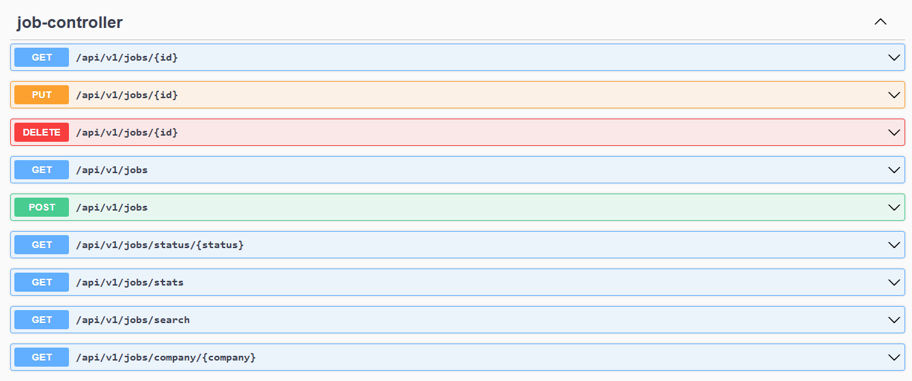
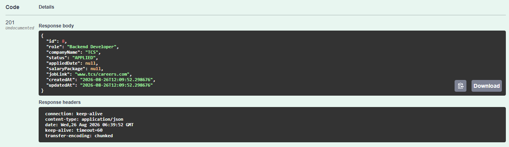
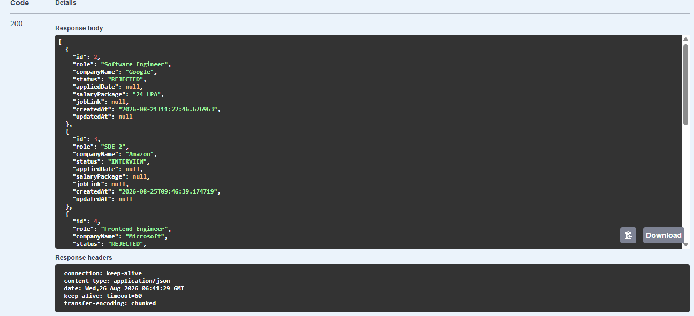
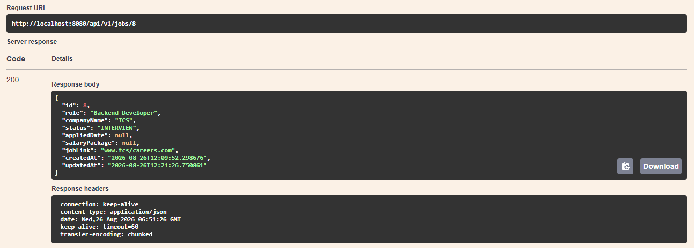
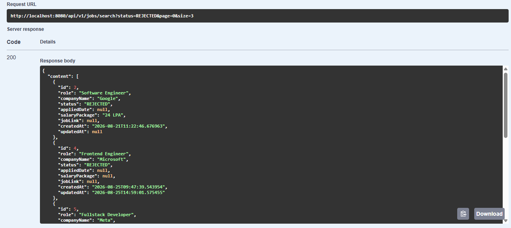
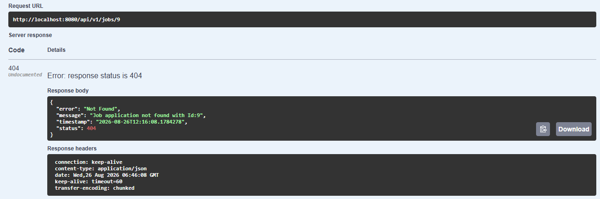
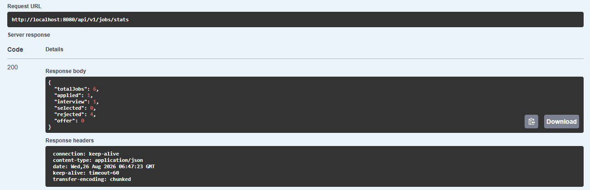

# 📌 Job Application Tracker API

A Spring Boot RESTful API for managing the complete lifecycle of job applications. The project focuses on domain validation, finite-state-machine constraints, automated database auditing, server-side pagination, structured global error handling, and automated unit testing.

---

## 📸 Screenshots & API Walkthrough

### 1. Interactive OpenAPI / Swagger Documentation

Overview of all REST endpoints exposed by the service.

### 2. Create Job Application (`POST /api/jobs`)

Successful creation of a job application returning a `201 Created` status with auto-generated timestamps.

### 3. Fetch All Applications (`GET /api/jobs`)

Retrieving persisted application records from the database.

### 4. Update Job Application & State Machine (`PUT /api/jobs/{id}`)

Updating application details and transitioning state while preserving the original `createdAt` timestamp.

### 5. Server-Side Pagination & Dynamic Filtering

Efficiently retrieving data in bounded pages using Spring Data JPA `Pageable` (`page`, `size`, `sortBy`) and custom filters.

### 6. Centralized Error Handling & Validation

Predictable, structured JSON error response when querying a non-existent resource (`404 Not Found`).

### 7. Aggregate Statistics (`GET /api/jobs/stats`)

Real-time breakdown and aggregate counts of applications grouped by their current lifecycle status.

---

## 🚀 Key Features & Architectural Highlights

- **Clean Layered Architecture:** Separates HTTP handling, business logic, persistence, and API data models across Controller, Service, Repository, and DTO layers.
- **Finite-State Machine Constraints:** Enforces valid lifecycle transitions (`APPLIED` → `INTERVIEW_SCHEDULED` → `OFFERED` / `REJECTED`) and blocks illegal modifications on terminal states.
- **Automated Database Auditing:** Automatically tracks `createdAt` and `updatedAt` metadata through JPA/Hibernate auditing support.
- **Server-Side Pagination:** Uses Spring Data JPA `Pageable` to retrieve data in bounded pages instead of loading the complete result set into application memory.
- **Dynamic Filtering:** Supports filtering application records based on relevant request parameters.
- **Centralized Exception Handling:** Uses `@RestControllerAdvice` to map domain-specific and validation exceptions to consistent error responses.
- **Service-Layer Unit Testing:** Tests business logic using JUnit 5 and Mockito while isolating the Service layer from the database through repository mocking.
- **Interactive API Documentation:** Provides an OpenAPI 3.0 contract rendered through Swagger UI.
- **Database Persistence:** Uses JPA/Hibernate with MySQL for relational data persistence.
- **Auditable Application Lifecycle:** Maintains creation and modification timestamps automatically at the persistence layer.

---

## 🧠 Engineering Decisions

### Why Layered Architecture?

The application separates HTTP handling, business rules, persistence, and API models into distinct layers.

The main request flow is:

Client → Controller → Service → Repository → Database

The Controller handles HTTP concerns, the Service owns business rules, and the Repository handles persistence. This separation reduces coupling and makes the business logic easier to test independently from HTTP and database infrastructure.

### Why DTOs Instead of Exposing JPA Entities?

The API uses DTOs at the application boundary instead of directly exposing JPA entities.

This keeps the external API contract separate from the persistence model. Changes to the database entity do not necessarily need to change the API contract exposed to clients.

### Why Validate Job Status Transitions?

A job application has a defined lifecycle rather than allowing arbitrary status changes.

The lifecycle is represented as:

APPLIED → INTERVIEW_SCHEDULED → OFFERED / REJECTED

OFFERED and REJECTED are terminal states and cannot transition back to previous states.

These transition rules are enforced in the Service layer because they represent business rules rather than HTTP or persistence concerns.

### Why Server-Side Pagination?

Returning every application in a single response does not scale with dataset size.

Using Spring Data JPA `Pageable` allows the application to retrieve only the required page of records instead of loading the complete result set into application memory.

This keeps response sizes bounded and makes resource usage more predictable as the dataset grows.

### Why Centralized Exception Handling?

Exception handling is centralized using `@RestControllerAdvice` instead of repeating error-handling logic across individual controllers.

This provides a consistent error response structure and keeps controllers focused on request handling.

### Why Automated Database Auditing?

`createdAt` and `updatedAt` represent persistence metadata rather than client-provided business data.

They are therefore maintained automatically by the persistence layer instead of requiring API clients to provide or modify these values.

### Why Unit Test the Service Layer?

The Service layer contains important business rules such as job-status transition validation.

JUnit 5 and Mockito are used to isolate the Service from the Repository, allowing business rules to be tested without requiring a running database.

---

## 🔄 Request & Persistence Flow

A typical application request moves through the following layers:

Client
↓
HTTP Request
↓
Spring MVC / DispatcherServlet
↓
Controller
↓
Service
↓
Repository
↓
Spring Data JPA
↓
Hibernate
↓
JDBC
↓
MySQL

Each layer has a specific responsibility:

- **Controller:** Handles the HTTP/API boundary.
- **Service:** Applies application and business rules.
- **Repository:** Provides the persistence abstraction.
- **Spring Data JPA:** Provides repository infrastructure and query abstraction.
- **Hibernate:** Implements JPA persistence and ORM behavior.
- **JDBC:** Provides the Java database connectivity layer.
- **MySQL:** Persists the relational data.

---

## 🏗️ Application Architecture

The application follows a layered architecture:

- **Controller Layer:** Receives HTTP requests, validates request input, and returns HTTP responses.
- **Service Layer:** Contains business logic and job lifecycle validation.
- **Repository Layer:** Handles persistence through Spring Data JPA.
- **DTO Layer:** Defines the API request and response models.
- **Entity Layer:** Represents persistent database state.
- **Exception Layer:** Provides centralized and structured error handling.

The separation allows each layer to evolve independently and keeps infrastructure concerns separate from business rules.

---

## 🔐 Key Responsibilities

### Controller

- Defines REST API endpoints.
- Handles HTTP methods and request mappings.
- Receives request parameters, path variables, and request bodies.
- Returns appropriate HTTP responses.

### Service

- Contains business logic.
- Validates job application state transitions.
- Prevents invalid operations on terminal states.
- Coordinates repository operations.
- Provides a testable boundary for application rules.

### Repository

- Provides database access through Spring Data JPA.
- Handles persistence operations.
- Supports pagination and filtering through repository queries.

### Entity

- Represents persistent application data.
- Defines the mapping between Java objects and relational database structures.
- Maintains persistence-related metadata.

### DTO

- Defines the API contract.
- Prevents direct exposure of persistence entities.
- Controls the data exchanged between the client and application.

### Exception Handling

- Centralizes API error handling.
- Converts application exceptions into predictable HTTP responses.
- Provides consistent error structures for clients.

---

## 🛠️ Tech Stack

- **Language:** Java 17+
- **Framework:** Spring Boot 3
- **Web:** Spring MVC
- **Persistence:** Spring Data JPA, Hibernate
- **Database:** MySQL
- **Testing:** JUnit 5, Mockito
- **API Documentation:** SpringDoc OpenAPI 3 / Swagger UI
- **Build Tool:** Maven

---

## 🔌 API Endpoints Reference

| HTTP Method | Endpoint | Description | Request Body / Params |
| :--- | :--- | :--- | :--- |
| `POST` | `/api/jobs` | Create a new application | `JobApplicationRequestDTO` |
| `GET` | `/api/jobs` | Get paginated application records | `page`, `size`, `sortBy` |
| `GET` | `/api/jobs/{id}` | Get application details by ID | Path variable `id` |
| `PUT` | `/api/jobs/{id}` | Update application details & state | `JobApplicationRequestDTO` |
| `DELETE` | `/api/jobs/{id}` | Remove an application by ID | Path variable `id` |
| `GET` | `/api/jobs/stats` | Retrieve aggregate metrics by status | None |

---

## 🧪 Testing

The Service layer is tested using JUnit 5 and Mockito.

The tests isolate business logic from the persistence layer by mocking repository dependencies.

Key scenarios include:

- Successful job creation.
- Successful job update.
- Valid job status transitions.
- Invalid job status transitions.
- Attempts to modify terminal states.
- Handling of non-existent job applications.
- Repository interaction verification.

Run the unit tests with:

    ./mvnw test

---

## ▶️ Getting Started

### Prerequisites

- Java 17 or later
- MySQL
- Maven or Maven Wrapper

### Clone the Repository

    git clone https://github.com/Saravan-git-hub/job-application-tracker.git

### Configure Database

Create a MySQL database and configure the database connection in the application's configuration.

Example:

    spring.datasource.url=jdbc:mysql://localhost:3306/job_tracker
    spring.datasource.username=your_username
    spring.datasource.password=your_password

### Run the Application

Using Maven Wrapper:

    ./mvnw spring-boot:run

The API will be available through the configured application port.

Swagger UI can be used to explore and test the API endpoints.

---

## 📖 API Documentation

The API is documented using OpenAPI 3.0 and exposed through Swagger UI.

Swagger provides an interactive interface for:

- Viewing available endpoints.
- Inspecting request and response models.
- Testing API operations.
- Understanding HTTP methods and status codes.

---

## 🗄️ Persistence & ORM

The application uses Spring Data JPA with Hibernate as the JPA implementation.

The persistence flow is:

Application
↓
Spring Data JPA
↓
JPA EntityManager
↓
Hibernate ORM
↓
JDBC
↓
MySQL

The application works with Java entities and repository abstractions while Hibernate handles the ORM mapping and SQL generation required to communicate with the relational database.

---

## 📌 Engineering Scope

This project intentionally focuses on understanding backend fundamentals and the engineering responsibilities of a Spring Boot application rather than adding unnecessary infrastructure.

The project demonstrates:

- REST API design.
- Layered architecture.
- Dependency injection.
- Business-rule enforcement.
- ORM-based persistence.
- Database interaction.
- Pagination and filtering.
- Exception handling.
- Automated testing.
- API documentation.

---

## 🚧 Future Improvements

Potential future improvements include:

- Authentication and authorization.
- Integration and end-to-end testing.
- Docker-based deployment.
- Structured application logging and observability.
- Database indexing and query-performance analysis.
- Concurrency and transaction-boundary analysis.
- CI/CD automation.
- Production deployment and monitoring.

---

## 📄 License

This project is intended for learning, portfolio demonstration, and backend engineering practice.